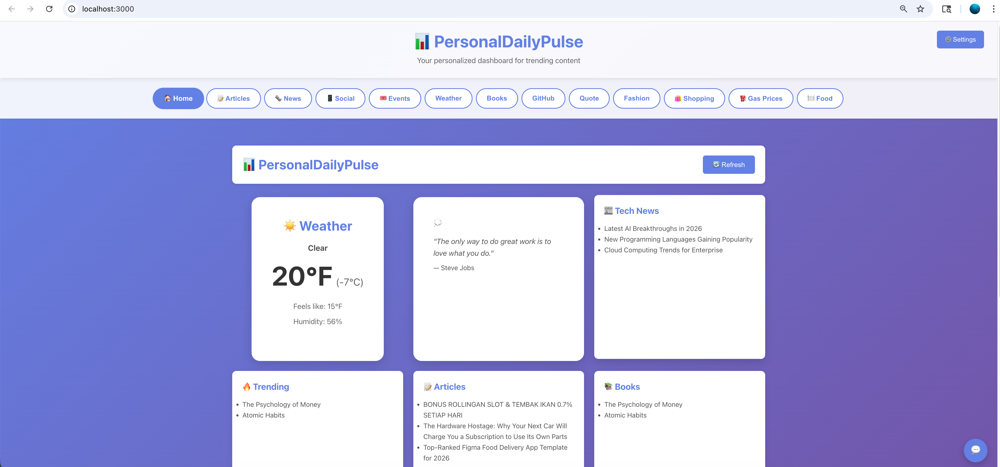
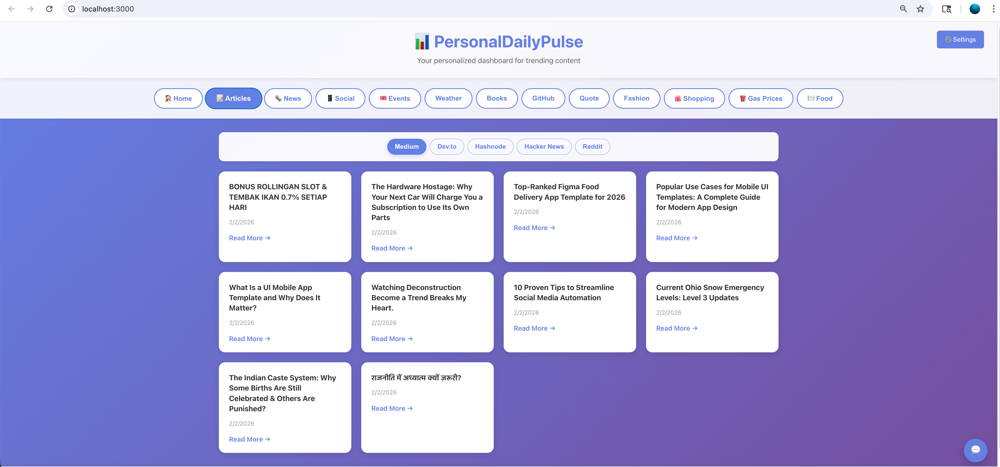
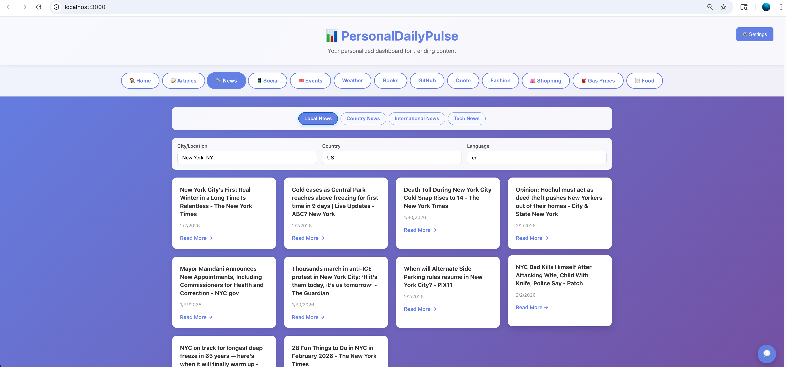
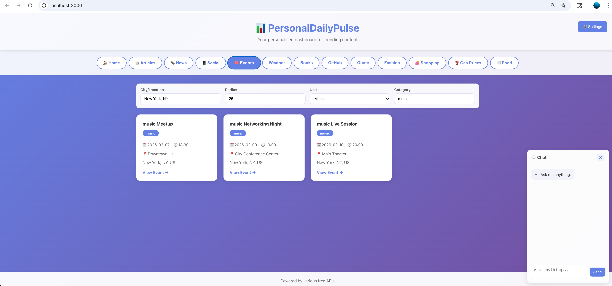
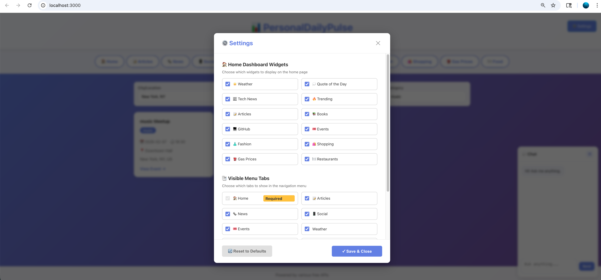

# PersonalDailyPulse 🌟

> A comprehensive personalized dashboard powered by **LangChain + Groq AI** that aggregates trending content, news, events, articles, and more from various sources using intelligent agents.

[](LICENSE)
[](https://www.python.org/)
[](https://reactjs.org/)
[](https://fastapi.tiangolo.com/)

**PersonalDailyPulse** is your one-stop dashboard for staying updated with the latest news, articles, events, weather, tech trends, and more - all in one place with an intelligent AI chatbot powered by Groq LLM.

---

## 📸 Screenshots

### Home Dashboard


### Articles Tab


### News Tab with Filters


### Events Discovery



### Settings


> **Note:** Add your screenshots to the `screenshots/` folder with the names: `home.png`, `articles.png`, `news.png`, `events.png`, `food.png`, `chatbot.png`

---

## ✨ Features

### 📰 Content Aggregation
- **Articles** - Medium, Dev.to, Hashnode, Hacker News, Reddit
- **News** - Local, Country, International, and Tech news with location/language filters
- **Social Media** - Twitter/X and LinkedIn trending content (placeholder data)
- **Events** - Discover nearby events with Ticketmaster integration
- **Books** - Trending books from Open Library
- **GitHub** - Trending repositories across languages
- **Movies & TV** - Trending movies and shows
- **Food** - Restaurant recommendations by cuisine (Italian, Indian, Chinese, Thai, Asian, Vegan)
- **Shopping** - Product deals and recommendations
- **Gas Prices** - Compare local gas station prices
- **Fashion** - Latest fashion trends
- **Weather** - Current weather conditions

### 🤖 AI-Powered Chatbot
- Natural language queries powered by Groq LLM (Mixtral-8x7b)
- 17+ specialized tools for intelligent data fetching
- Conversational interface for asking anything

### 🎨 Smart Filters
- **Location-based** - Autocomplete for cities and countries
- **Category filters** - Music, Sports, Tech, Food, Arts, and more
- **Cuisine filters** - Search restaurants by food type
- **Language support** - Multi-language news filtering

### 🌐 Modern UI/UX
- Responsive design for mobile and desktop
- Tab-based navigation with submenus
- Collapsible AI chat panel (bottom-right corner)
- Real-time content loading with loading states

---

## 🚀 Quick Start

### Prerequisites

Before you begin, ensure you have the following installed:

- **Python 3.8+** ([Download](https://www.python.org/downloads/))
- **Node.js 14+** ([Download](https://nodejs.org/))
- **npm or yarn** (comes with Node.js)
- **Groq API Key** (free tier available at [console.groq.com](https://console.groq.com))

### Installation

#### 1️⃣ Clone the Repository

```bash
git clone https://github.com/yourusername/personal-daily-pulse.git
cd personal-daily-pulse
```

#### 2️⃣ Backend Setup

```bash
# Navigate to backend directory
cd backend

# Create virtual environment (recommended)
python3 -m venv .venv
source .venv/bin/activate  # On Windows: .venv\Scripts\activate

# Install dependencies
pip install -r requirements.txt
```

#### 3️⃣ Configure Environment Variables

Create a `.env` file in the root directory:
📖 Usage Guide

### Main Tabs

1. **🏠 Home** - Quick overview dashboard with weather, tech news, quotes, and trending content
2. **📝 Articles** - Browse articles from Medium, Dev.to, Hashnode, Hacker News, Reddit
3. **🗞️ News** - Local, Country, International, and Tech news with location/country/language filters
4. **📱 Social** - Twitter/X and LinkedIn trending content
5. **🎟️ Events** - Discover nearby events with location/radius/category filters
6. **☀️ Weather** - Current weather conditions with temperature and humidity
7. **📚 Books** - Trending books and recommendations
8. **💻 GitHub** - Trending repositories by language
9. **💭 Quotes** - Inspirational quote of the day
10. **👗 Fashion** - Latest fashion trends
11. **🛍️ Shopping** - Product deals and recommendations
12. **⛽ Gas Prices** - Compare local gas station prices with map view
13. **🍽️ Food** - Restaurant recommendations by cuisine (Italian, Indian, Chinese, Thai, Asian, Vegan)

### AI Chatbot

Click the **💬** button at the bottom-right to open the AI chatbot:
- Ask questions about any topic
- Request specific information (e.g., "Show me events near New York")
- Get personalized recommendations
- Natural language queries powered by Groq LLM

### Settings & Customization

Click the **⚙️ Settings** button to customize:
- **Home Dashboard Widgets** - Toggle which cards appear on the home page
- **Visible Menu Tabs** - Show/hide tabs in the navigation menu
- **Reset to Defaults** - Restore original settings

All settings are saved in your browser's localStorage.🏗️ Architecture

### Tech Stack

#### Backend
- **Framework**: FastAPI (Python)
- **AI/LLM**: LangChain + Groq (Mixtral-8x7b)
- **APIs**: Ticketmaster, TMDB, OpenWeather, Yelp, NewsAPI
- **Data Sources**: RSS feeds (Medium, Dev.to, Hashnode, Hacker News, Reddit)

#### Frontend
- **Framework**: React 19.2.4
- **Styling**: CSS3 with Flexbox/Grid
- **HTTP Client**: Fetch API
- **State Management**: React Hooks (useState, useEffect)

#### LLM & Tools
- **LLM Provider**: Groq Cloud
- **Model**: `mixtral-8x7b-32768` (default)
- **Agent Type**: LangChain StructuredTool
- **Tools**: 17+ specialized tools for data fetching

### Project Structure

```
personal-daily-pulse/
├── backend/
│   ├── agent.py              # LangChain agent with Groq LLM
│   ├── app.py                # FastAPI server with all endpoints
│   ├── config.py             # API configuration
│   ├── requirements.txt      # Python dependencies
│   ├── tools/                # LangChain tools
│   │   ├── __init__.py
│   │   ├── articles_tools.py
│   │   ├── books_tools.py
│   │   ├── entertainment_tools.py
│   │   ├── events_tools.py
│   │   ├── fashion_tools.py
│   │   ├── food_tools.py
│   │   ├── gas_tools.py
│   │   ├── github_tools.py
│   │   ├── google_news_tools.py
│   │   ├── local_news_tools.py
│   │   ├── medium_tools.py
│   │   ├── movies_tools.py
│   │   ├── news_tools.py
│   │   ├── quotes_tools.py
│   │   ├── shopping_tools.py
│   │   ├── tech_tools.py
│   │   ├── utility_tools.py
│   │   ├── utils.py
│   │   └── weather_tools.py
│   └── scripts/              # Legacy scripts
├── frontend/
│   ├── public/
│   │   └── index.html
│   ├── src/
│   │   ├── App.js            # Main React component
│   │   ├── App.css           # Styles
│   │   ├── index.js
│   │   └── hooks/
│   │       └── useAgent.js
│   └── package.json
├── screenshots/              # Application screenshots
├── .env.example              # Environment variables template
├── README.md                 # This file
├── start-backend.sh          # Backend startup script
└── start-frontend.sh         # Frontend startup script
```

---

## ⚙️ Configuration

### Groq Models

You can change the LLM model in [`backend/agent.py`](backend/agent.py):

```python
llm = ChatGroq(
    model="mixtral-8x7b-32768",  # Change this
    temperature=0.3,
    groq_api_key=groq_api_key
)
```

**Available Models:**
- `mixtral-8x7b-32768` (default) - Best performance & speed
- `llama2-70b-4096` - Large context, slower
- `gemma-7b-it` - Lightweight and efficient

### Default Settings

Edit [`backend/config.py`](backend/config.py) to change:
- Default location for weather/events
- Default country code
- API base URLs
- Timeout values

### Frontend Customization

Edit [`frontend/src/App.css`](frontend/src/App.css) to customize:
- Color scheme
- Font sizes
- Layout dimensions
- Chat panel positioning
| Endpoint | Method | Description |
|----------|--------|-------------|
| `/api/weather` | GET | Local weather |
---

## 🐛 Troubleshooting

### Common Issues

#### 1. `GROQ_API_KEY not found`
```bash
# Set environment variable
export GROQ_API_KEY="your-groq-api-key"

# Verify it's set
echo $GROQ_API_KEY

# Or add to .env file
echo "GROQ_API_KEY=your-groq-api-key" > .env
```

#### 2. Backend won't start - Port 5000 in use
```bash
# Find process using port 5000
lsof -i :5000

# Kill the process
kill -9 <PID>

# Or change port in backend/app.py
```

#### 3. Frontend won't start - Port 3000 in use
```bash
# Find process using port 3000
lsof -i :3000

# Kill the process
kill -9 <PID>

# Or the frontend will prompt to use another port
```

#### 4. API returns mock/fallback data
- **Cause**: Missing optional API keys
- **Solution**: Add the relevant API key to `.env` file
- **Note**: Most features work with RSS feeds without API keys

#### 5. "Failed to fetch" errors
- Check backend is running on http://localhost:5000
- Verify CORS settings in `backend/app.py`
- Check browser console for specific error messages

#### 6. Events not loading
- Requires Ticketmaster API key for real data
- Without key, shows mock/sample events
- Get free key at [developer.ticketmaster.com](https://developer.ticketmaster.com/)

---

## 📚 Resources & Documentation

- **Groq Console**: [console.groq.com](https://console.groq.com)
- **LangChain Docs**: [python.langchain.com](https://python.langchain.com)
- **FastAPI Docs**: [fastapi.tiangolo.com](https://fastapi.tiangolo.com/)
- **React Docs**: [react.dev](https://react.dev/)
- **API Integration Guide**: [API_INTEGRATION_GUIDE.md](API_INTEGRATION_GUIDE.md)

---

## 🤝 Contributing

Contributions are welcome! Here's how you can help:

1. **Fork** the repository
2. **Create** a feature branch (`git checkout -b feature/AmazingFeature`)
3. **Commit** your changes (`git commit -m 'Add some AmazingFeature'`)
4. **Push** to the branch (`git push origin feature/AmazingFeature`)
5. **Open** a Pull Request

### Development Guidelines

- Follow existing code style and conventions
- Add comments for complex logic
- Test all endpoints before submitting PR
- Update README if adding new features

---

## 📝 License

This project is licensed under the MIT License - see the [LICENSE](LICENSE) file for details.

---

## 👨‍💻 Author

**Your Name**
- GitHub: [@wshamim](https://github.com/wshamim1)


---

## 🙏 Acknowledgments

- **Groq** for providing fast LLM inference
- **LangChain** for the agent framework
- **Ticketmaster, TMDB, Yelp, OpenWeather** for their APIs
- **Dev.to, Hashnode, Hacker News, Reddit** for content feeds
- All open-source contributors

---

## 🎉 Enjoy PersonalDailyPulse!

If you find this project helpful, please ⭐ **star** the repository and share it with others!

**Happy browsing! 📊✨**

# Start the development server
npm start
```

Frontend runs on **http://localhost:3000**

#### 6️⃣ Access the Application

Open your browser and visit: **http://localhost:3000**

---

## API Endpoints

### New LangChain Agent Endpoints

- `GET /api/query?q=your_question` - Ask the AI agent anything
- `GET /api/news?topic=TECHNOLOGY` - Get news by topic
- `GET /api/weather` - Get local weather
- `GET /api/trends` - Get trending content
- `GET /api/github?language=python` - GitHub trends by language
- `GET /api/agent/info` - See available tools

### Example Queries

```bash
# Ask the agent anything
curl "http://localhost:5000/api/query?q=What's%20trending%20in%20tech%20today?"

# Get specific information
curl "http://localhost:5000/api/news?topic=TECHNOLOGY"
curl "http://localhost:5000/api/weather"
curl "http://localhost:5000/api/github?language=python"
```

## Quick Start

1. **Get Groq API Key**
   - Visit https://console.groq.com
   - Create a free account
   - Generate an API key

2. **Configure Backend**
   ```bash
   cd backend
   export GROQ_API_KEY="your-api-key"
   pip install -r requirements.txt
   python app.py
   ```

3. **Test Agent**
   ```bash
   curl "http://localhost:5000/api/query?q=Tell%20me%20about%20trending%20tech%20news"
   ```

4. **Start Frontend**
   ```bash
   cd ../frontend
   npm install
   npm start
   ```

## Architecture

- **Backend**: Flask + LangChain + Groq
- **Frontend**: React (to be updated with new agent UI)
- **LLM**: Groq (mixtral-8x7b-32768 or llama2-70b-4096)
- **Tools**: 17+ specialized tools for data fetching

## Configuration

### Groq Models Available
- `mixtral-8x7b-32768` (default) - Best performance
- `llama2-70b-4096` - Large context model
- `gemma-7b-it` - Efficient model

Change in `backend/agent.py` line 29

### Optional: Other LLM Providers

The agent can be extended to support:
- OpenAI (GPT-4, GPT-3.5)
- Google Generative AI (Gemini)
- Other providers via LangChain

See [LANGCHAIN_GUIDE.md](./LANGCHAIN_GUIDE.md) for details

## Troubleshooting

**GROQ_API_KEY not found**
```bash
export GROQ_API_KEY="your-key"
# Verify with:
echo $GROQ_API_KEY
```

**Connection issues**
- Check internet connection
- Verify Groq API key is valid
- Check firewall/proxy settings

## Resources

- [Groq Documentation](https://console.groq.com/docs)
- [LangChain Documentation](https://python.langchain.com)
- [LangChain Agent Guide](./LANGCHAIN_GUIDE.md)


## Project Structure

```
personal-daily-pulse/
├── backend/          # Flask API
├── frontend/         # React app
├── mediums/          # Medium scripts
├── news/             # News scripts
├── weather/          # Weather scripts
├── books/            # Books scripts
├── movies/           # Movies/TV scripts
├── github/           # GitHub scripts
├── tech/             # Tech news scripts
├── quotes/           # Quotes scripts
├── fashion/          # Fashion scripts
├── food/             # Food/restaurant scripts
├── gas/              # Gas station scripts
├── shopping/         # Shopping scripts
└── youtube/          # YouTube scripts
```

## Usage

1. Start the backend server
2. Start the React frontend
3. Open http://localhost:3000 in your browser
4. Click on tabs to view different content types

Enjoy your PersonalDailyPulse! 🎉
